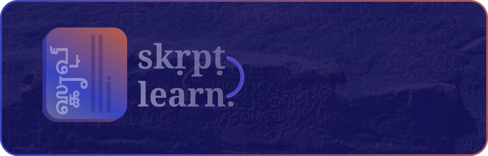

# Skṛpṭ Learn
### A way to familiarize oneself with new scripts and writing systems.

## Features
- **Practicing new scripts**: Practice the new script, and measure your progress through the scoring system.
- **Difficulty of practice**: Make the practice as challenging as needed by adjusting the difficulty.
- **Learning new scripts**: Begin from the basics through the _learning mode_, gradually increasing the difficulty until you have learnt the entire script.
- **Extensibility**: Supports a wide range of scripts, and is relatively simple to add a new script to the existing framework.

### Languages/scripts currently supported
- Bengali (abugida)
- Devanagiri (Sanskrit variant) (abugida)
- Greek (alphabet)
- Russian (alphabet)
- Tamil (abugida)
- Telugu (abugida)
- _Urdu (alphabet) (review)_

Please open a PR to contribute a new script.

## Roadmap

See [`roadmap.md`](./roadmap.md).
