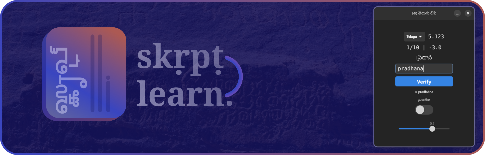

# Skṛpṭ Learn

### A way to familiarize oneself with new phonetic scripts and writing systems.

## Features

- **Practicing new scripts**: Practice the new script, and measure your progress through the scoring system.
- **Difficulty of practice**: Make the practice as challenging as needed by adjusting the difficulty.
- **Learning new scripts**: Begin from the basics through the _learning mode_, gradually increasing the difficulty until you have learnt the entire script.
- **Extensibility**: Supports a wide range of scripts, and is relatively simple to add a new script to the existing framework.

### Languages/scripts currently supported

- Bengali (abugida)
- Devanagiri (Sanskrit variant) (abugida)
- Greek (alphabet)
- Russian (alphabet)
- Tamil (abugida)
- Telugu (abugida)
- Urdu (alphabet)

Please open a PR to contribute a new script.

## Roadmap

See [`roadmap.md`](./roadmap.md).

Releases will be available soon.

Launch in browser: `xpra start --start='xterm nethack' :10 --bind-tcp=0.0.0.0:10000 --html=on --auth=none --no-daemon`

Add these modules to dockerfile:
2025-11-09 10:55:32,077 client   1 visibilitychange hidden= true connected= true

2025-11-09 10:55:32,781 client   1 visibilitychange hidden= false connected= true

2025-11-09 10:55:40,787 client   1 visibilitychange hidden= true connected= true

2025-11-09 10:55:51,680 client   1 visibilitychange hidden= false connected= true

2025-11-09 10:56:21,142 client   1 visibilitychange hidden= true connected= true

2025-11-09 10:56:51,824 client   1 visibilitychange hidden= false connected= true

2025-11-09 10:57:06,345 xpra client 1 disconnected.

2025-11-09 10:57:06,867 Handshake complete; enabling connection

2025-11-09 10:57:06,869 Error setting up client dbus instance:

2025-11-09 10:57:06,869  No module named 'dbus'

2025-11-09 10:57:06,869  automatic picture encoding enabled, also available:

2025-11-09 10:57:06,869   jpeg, png, rgb32, webp, h264, mpeg1

2025-11-09 10:57:06,870 HTML5 Posix Firefox client version 3.1.3

2025-11-09 10:57:06,871 keyboard mapping already configured (skipped)

2025-11-09 10:57:06,871  client root window size is 1758x960 with 1 display:

2025-11-09 10:57:06,871   HTML (465x254 mm - DPI: 96x96)

2025-11-09 10:57:06,871     Canvas

2025-11-09 10:57:06,872 best resolution matching 1758x960 is unchanged: 1758x960

2025-11-09 10:57:06,883 client   2 received xdg start menu data

2025-11-09 10:57:06,883 client   2 startup complete

2025-11-09 10:57:06,883 client   2 connection-established

2025-11-09 10:57:11,793 client   2 visibilitychange hidden= true connected= true

2025-11-09 10:57:25,595 got signal SIGTERM

2025-11-09 10:57:25,595 exiting

2025-11-09 10:57:25,595 Disconnecting client ('192.168.65.1', 24117):

2025-11-09 10:57:25,595  server shutdown

2025-11-09 10:57:25,597 xpra client 2 disconnected.

2025-11-09 10:57:25,600 closing tcp socket '0.0.0.0:10000'

2025-11-09 10:57:25,600 removing socket '/run/user/0/xpra/40c2de7488c3-10'

2025-11-09 10:57:25,600 removing socket '/run/xpra/40c2de7488c3-10'

2025-11-09 10:57:25,600 removing socket '/root/.xpra/40c2de7488c3-10'

2025-11-09 10:57:25,603 killing xvfb with pid 8
